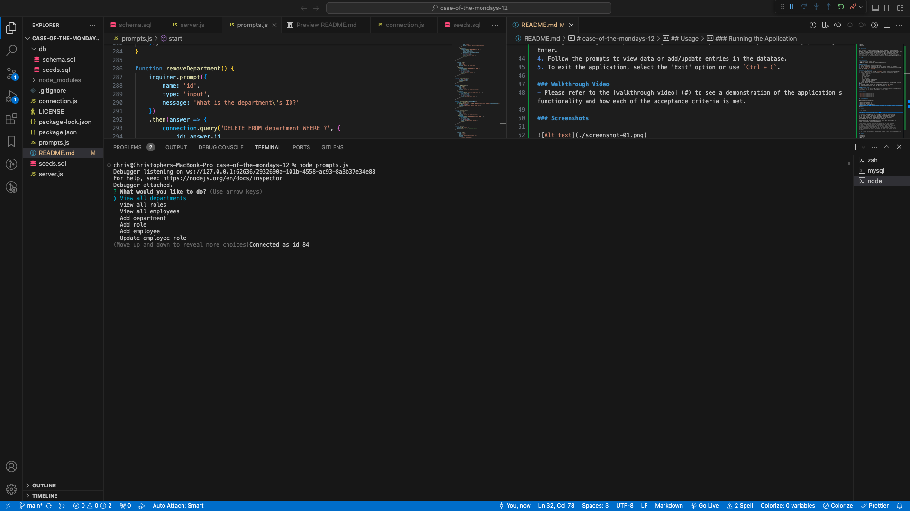
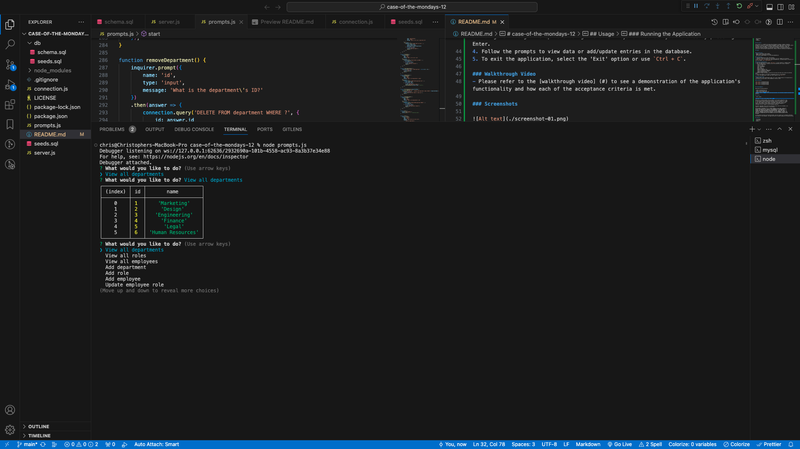
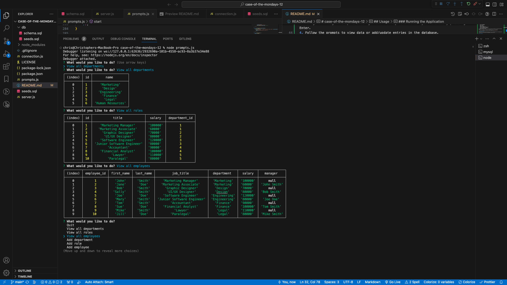
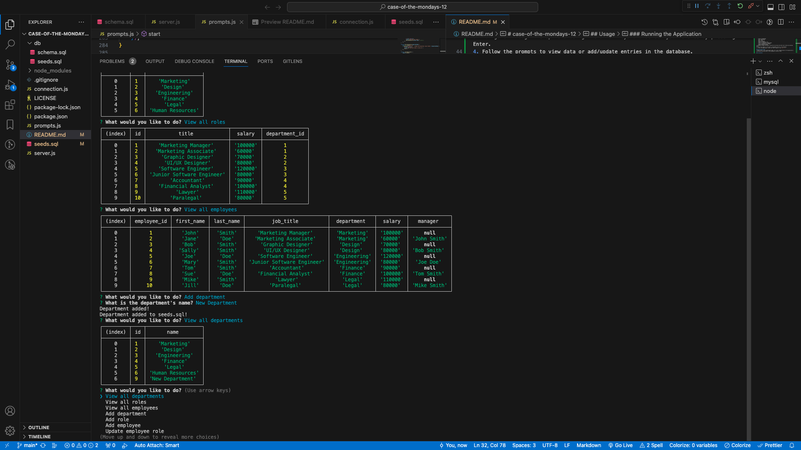

# case-of-the-mondays-12
SQL Employee tracker database

## Table of Content

- Description
- Usage
- Features

## Description

This project is a command-line application designed to manage a company's employee database. It serves as a simple Content Management System (CMS) that allows business owners to interact with and organize information regarding their departments, roles, and employees. Built with Node.js, the application leverages the Inquirer package for interactive prompts and MySQL for persistent data storage. It provides an intuitive interface to view and modify employee data, aiding in business planning and organization.

## Usage

### Prerequisites
- Node.js installed on your system
- MySQL server running and accessible
- NPM (Node Package Manager) for installing dependencies

### Installation
1. Clone the repository to your local machine.
2. Navigate to the root directory of the project via your command line interface.
3. Run `npm install` to install the required dependencies, including Inquirer version 8.2.4 with the command `npm i inquirer@8.2.4`.

### Running the Application
1. Start the application by running `node app.js` in your terminal or command prompt.
2. Once the application is running, you will be presented with a menu of options:
   - View all departments
   - View all roles
   - View all employees
   - Add a department
   - Add a role
   - Add an employee
   - Update an employee role
   - View all employees by department
   - View all employees by manager
   - Update employee manager
3. Navigate through the options using the arrow keys and select your choice by pressing Enter.
4. Follow the prompts to view data or add/update entries in the database.
5. To exit the application, select the 'Exit' option or use `Ctrl + C`.

### Walkthrough Video
- Please refer to the [walkthrough video](.assets/MySQL_walkthrough.webm) to see a demonstration of the application's functionality and how each of the acceptance criteria is met.

### Screenshots 

## Acknowledgments

Referenced following websites:

- https://stackoverflow.com
- https://www.w3schools.com
- https://forum.codewithmosh.com/
- Special thanks to Xpert, the AI Learning Assistant, for providing valuable assistance and guidance.

## License

---MIT License

Copyright (c) [2023] [Christopher Robert Naro]

Permission is hereby granted, free of charge, to any person obtaining a copy
of this software and associated documentation files (the "Software"), to deal
in the Software without restriction, including without limitation the rights
to use, copy, modify, merge, publish, distribute, sublicense, and/or sell
copies of the Software, and to permit persons to whom the Software is
furnished to do so, subject to the following conditions:

The above copyright notice and this permission notice shall be included in all
copies or substantial portions of the Software.

THE SOFTWARE IS PROVIDED "AS IS", WITHOUT WARRANTY OF ANY KIND, EXPRESS OR
IMPLIED, INCLUDING BUT NOT LIMITED TO THE WARRANTIES OF MERCHANTABILITY,
FITNESS FOR A PARTICULAR PURPOSE AND NONINFRINGEMENT. IN NO EVENT SHALL THE
AUTHORS OR COPYRIGHT HOLDERS BE LIABLE FOR ANY CLAIM, DAMAGES OR OTHER
LIABILITY, WHETHER IN AN ACTION OF CONTRACT, TORT OR OTHERWISE, ARISING FROM,
OUT OF OR IN CONNECTION WITH THE SOFTWARE OR THE USE OR OTHER DEALINGS IN THE
SOFTWARE.

🏆 The previous sections are the bare minimum, and your project will ultimately determine the content of this document. You might also want to consider adding the following sections.

## Features

- CSS design
- JavaScript
- Node.js
- MySQL
## 